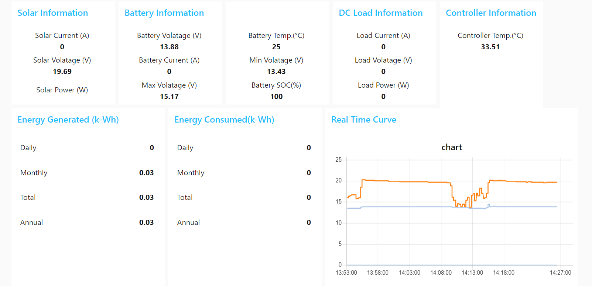
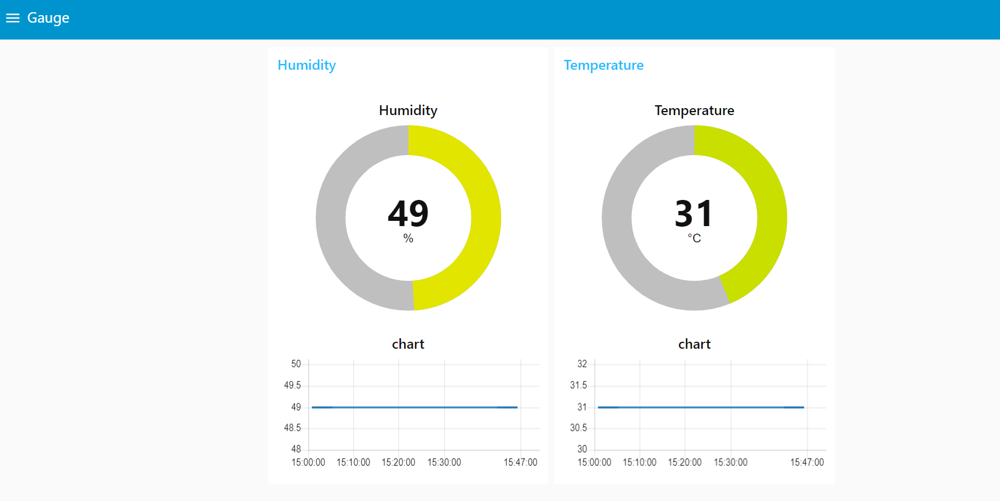

# Remote Solar Panel Managing Application
> Application that provides a way to manage the remote
Photovoltaic(PV) solar panels in real-time

## BackGround
> Amongst renewable energy sources, solar power energy is gaining popularity thanks to low carbon dioxide emission and increasing efficiency. 

> Photovoltaic(PV) solar panels are one of the ways to harness solar power into renewable energy with only a major initial cost but low maintenance. 

However, due to the tendency of solar energy systems being far away from the electricity users, energy health monitoring in real time and maintaining recovery from faults is the key goal. 

Our Application provide a way to interact and maintain an off-grid solar energy system from many miles away based on IOT Technology.


## Environment Setup

### Solar Panel

### Rasberry pi

### Lora NetWork

### AWS Ubuntu EC2

### Running Node-Red on AWS EC2 with Ubuntu

> Enter your AWS Instance
```git
ssh -i "pem key" ubuntu@"aws public IP"
```

> Make Virtual Environment Folder
```python
python3 -m venv ./myenv
```

> Activate Virtual Environment
```git
. myenv/bin/activate
```

> Setup Node-Red

```git
 curl -sL https://deb.nodesource.com/setup_12.x | sudo -E bash -
   sudo apt-get install -y nodejs build-essential
   sudo npm install -g --unsafe-perm node-red
```

> Get Node-Red to start automatically
whenever aws instance is restarted

```git
sudo npm install -g --unsafe-perm pm2
   pm2 start `which node-red` -- -v
   pm2 save
   pm2 startup
```

> start Node-Red in your instance

```git
node-red
```


_For more examples and usage, please refer to the [Running on AWS EC2 with Ubuntu][https://nodered.org/docs/getting-started/aws]._

## Flow Diagram

## Usage Example

### Node-Red


A few motivating and useful examples of how your product can be used. Spice this up with code blocks and potentially more screenshots.

<br/>




_For more examples and usage, please refer to the [Wiki][wiki]._

## Development setup

Describe how to install all development dependencies and how to run an automated test-suite of some kind. Potentially do this for multiple platforms.

```sh
make install
npm test
```
## Meta

Your Name – [@YourTwitter](https://twitter.com/dbader_org) – YourEmail@example.com

Distributed under the XYZ license. See ``LICENSE`` for more information.

[https://github.com/yourname/github-link](https://github.com/dbader/)

## Contributing

1. Fork it (<https://github.com/yourname/yourproject/fork>)
2. Create your feature branch (`git checkout -b feature/fooBar`)
3. Commit your changes (`git commit -am 'Add some fooBar'`)
4. Push to the branch (`git push origin feature/fooBar`)
5. Create a new Pull Request

<!-- Markdown link & img dfn's -->
[npm-image]: https://img.shields.io/npm/v/datadog-metrics.svg?style=flat-square
[npm-url]: https://npmjs.org/package/datadog-metrics
[npm-downloads]: https://img.shields.io/npm/dm/datadog-metrics.svg?style=flat-square
[travis-image]: https://img.shields.io/travis/dbader/node-datadog-metrics/master.svg?style=flat-square
[travis-url]: https://travis-ci.org/dbader/node-datadog-metrics
[wiki]: https://github.com/yourname/yourproject/wiki
