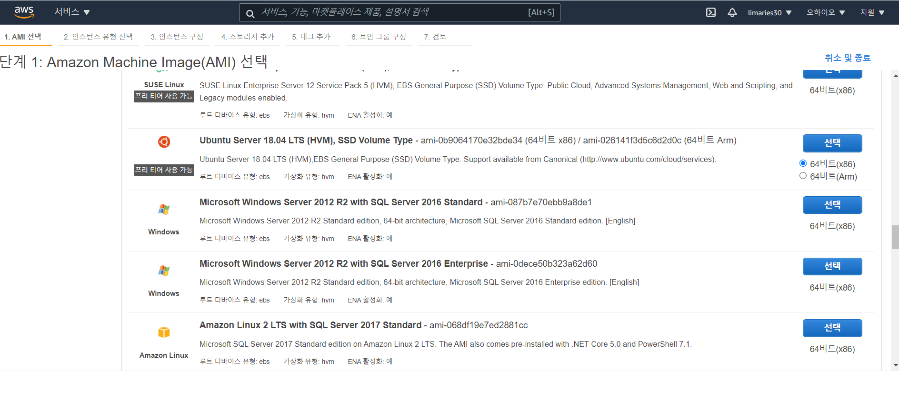

# Remote Solar Panel Managing Application
> Application that provides a way to manage the remote
Photovoltaic(PV) solar panels in real-time

<br/>
<br/>

## Link
[Application Link](http://18.116.64.150:1880/ui/)

<br/>
<br/>

## BackGround
> Amongst renewable energy sources, solar power energy is gaining popularity thanks to low carbon dioxide emission and increasing efficiency. 

> Photovoltaic(PV) solar panels are one of the ways to harness solar power into renewable energy with only a major initial cost but low maintenance. 

> However, due to the tendency of solar energy systems being far away from the electricity users, energy health monitoring in real time and maintaining recovery from faults is the key goal. 

> Our Application provide a way to interact and maintain an off-grid solar energy system from many miles away based on IOT Technology.


<br/>
<br/>

## Environment Setup

### Solar Panel

### Rasberry pi

### Lora NetWork

### AWS Ubuntu EC2

> Buy AWS Ubuntu EC2 Instance



> DownLoad your .pem key for Instance


> Edit Inbound Rule 

You have to open the port 1880 for Ip from anywhere


### Running Node-Red on AWS EC2 with Ubuntu

> Enter your AWS Instance
```git
ssh -i "pem key" ubuntu@"aws public IP"
```

> Make Virtual Environment Folder
```python
# setting up locale to prevent erro 
export LC_ALL="en_US.UTF-8"
export LC_CTYPE="en_US.UTF-8"

sudo dpkg-reconfigure locales
# All locales --> en_US.UTF-8

sudo apt-get update

# make virtual folder 
python3 -m venv ./myenv
```

> Activate Virtual Environment
```git
. myenv/bin/activate
```

> Setup Node-Red

```git
curl -sL https://deb.nodesource.com/setup_12.x | sudo -E bash -
sudo apt-get install -y nodejs build-essential
sudo npm install -g --unsafe-perm node-red
```

> Get Node-Red to start automatically
whenever aws instance is restarted

```git
sudo npm install -g --unsafe-perm pm2
pm2 start `which node-red` -- -v
pm2 save
pm2 startup
```

> start Node-Red in your instance

```git
node-red
```

_For more examples and usage, please refer to the [Running on AWS EC2 with Ubuntu][https://nodered.org/docs/getting-started/aws]._

<br/>
<br/>

## Flow Diagram


<br/>
<br/>

## Usage Example

### Node-Red

> Node-RED displays data saved in MongoDB

> The Node-RED pages consist of 1) Main tracer and 2) Gauge. 

> Main tracer shows the real time data from the MPPT controller. 
Data mainly consist of Solar, Battery, DC Load, Controller, Energy Information. 
Real-time Voltage data of PV, Battery, DC Load are shown as Chart also so that use can compare them easily. 

> Gauge shows outward humidity and temperature data. 
User can also see the real-time change of data with Chart below the page.
Displayed data is updated per 30 seconds, according to the timestamp. 
Most Recent data is shown every 30 seconds.


<br/>

> [1] Main Tracer


<br/>
<br/>

> [2] Gauge


_For more examples and usage, please refer to the [Wiki][wiki]._


<br/>
<br/>

## Development setup

Describe how to install all development dependencies and how to run an automated test-suite of some kind. Potentially do this for multiple platforms.

```sh
make install
npm test
```
## Meta

Your Name – [@YourTwitter](https://twitter.com/dbader_org) – YourEmail@example.com

Distributed under the XYZ license. See ``LICENSE`` for more information.

[https://github.com/yourname/github-link](https://github.com/dbader/)

## Contributing

1. Fork it (<https://github.com/yourname/yourproject/fork>)
2. Create your feature branch (`git checkout -b feature/fooBar`)
3. Commit your changes (`git commit -am 'Add some fooBar'`)
4. Push to the branch (`git push origin feature/fooBar`)
5. Create a new Pull Request

<!-- Markdown link & img dfn's -->
[npm-image]: https://img.shields.io/npm/v/datadog-metrics.svg?style=flat-square
[npm-url]: https://npmjs.org/package/datadog-metrics
[npm-downloads]: https://img.shields.io/npm/dm/datadog-metrics.svg?style=flat-square
[travis-image]: https://img.shields.io/travis/dbader/node-datadog-metrics/master.svg?style=flat-square
[travis-url]: https://travis-ci.org/dbader/node-datadog-metrics
[wiki]: https://github.com/yourname/yourproject/wiki
